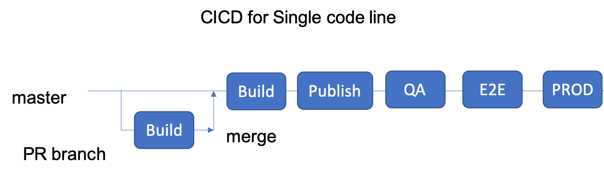
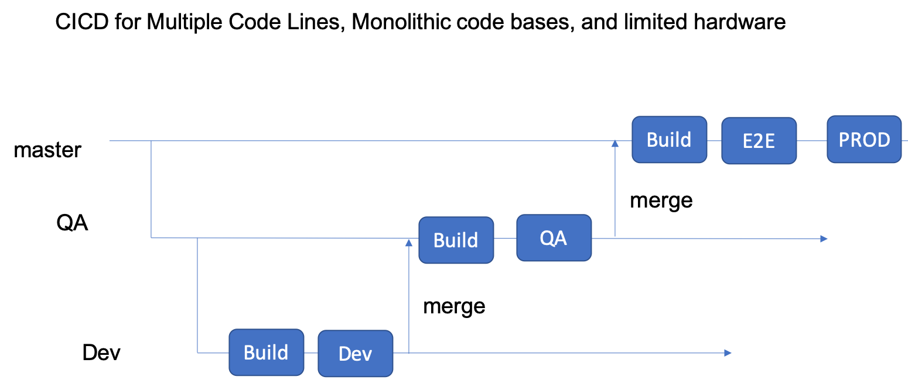

# CI/CD

CI/CD or Continuous Integration and Continuous Delivery and Deployment is a DevOps practice that aims at shortening time to market of new features and changes in a software product and improving developer productivity by automating the entire software release process from conception to delivery.

* Continuous Integration focuses on enabling teams to continuously integrate changes to main line, test them multiple times a day, and recover quickly from failures with consistent feedback loop.
* Continuous Delivery focuses on enabling teams to automatically deliver specific versions of the product to different environments and go through a set of tests.
* Continuous Deployment focuses on enabling teams to go automatically from code commit to production using the continuous integration and continuous delivery solutions along with promotion criteria that defines the readiness of the change to be released through a set of stages and finally to production

The main outcome of this practice is a CI/CD pipeline which continuously builds, deploys, tests, and promotes or drops changes through a set of stages before releasing it to production. A CI/CD pipeline highlighting Continuous Integration, Delivery, and Deployment is given in the diagram below:

 
 

## Continuous Integration

Continuous integration allows integration of code changes to the main line multiple times a day and allows for fast recovery by automatically building and testing these changes and providing constant and quick feedback to the committers. The outcome of Continuous Integration is a versioned deployable artifact that is stored in an artifact repository for consumption later by other services or for deployment. The main components of continuous integration are

* Continuous merges: Done using version control tools like Github, Perforce
* Automated builds : Done using standard build tools like Maven, Gradle, make, docker (for containers)
* Automated testing : Done using tools like junit
* Code Coverage calculation : Done using tools like JaCoCo and Cobertura
* Static Code Analysis : Done using tools like Checkstyle, Findbugs etc.
* Promotion Criteria, Change Monitoring, and Feedback Loop : Done using CI tools like Jenkins
* Artifact Storage: Done using tools like Nexus, Artifactory, Docker hub, PyPi etc.
 
 
 

 
 
 

## Continuous Delivery and Deployment

Continuous delivery is a practice that allows repetitive deployment of different versions of the application/service to different environments in a consistent and fail-safe way for testing. The deployment includes install and configuration of the new version of the software to support different hardware and testing requirements. A continuous delivery pipeline automatically deploys product artifacts created by the build stage to various environments and runs automatic tests on the application. It also automatically uses the test results to validate promotion criteria and promote the build to the next environment. While promotion to preproduction environments is automatic, the promotion to production is manual. A continuous deployment pipeline will also look the same with the exception that promotion to production is automatic and not manual. Main components of Continuous Delivery and Deployment are:

* Deployment Automation : Done using tools like Puppet, Chef, Scripts, Kubectl, AMIs etc.
* Test Automation :  
* Promotion Criteria, and Feedback Loop : Done using tools like Jenkins, Spinnaker etc.

 
 
 

 
 
 

## Pipelines and Branching Models

 The size and complexity of code bases, number of developers and amount of automated testing available often drives the branching pattern used in release management of a software product. The CI/CD pipelines can be tailored to fit the branching needs of a development team.

 The recommended branching model to get maximum productivity and shortest release time is the master only model with feature flags.

 * All commits on the main line go through build, deploy and test stages and are either dropped or queued up for production.
 * For testing changes before merging/integrating to master, builds can also be triggered on pull request branches.
 * Pull requests also allow for peer review before merging to master to keep the master healthy.

 This model works well for micro-services, small code bases, and small development teams that follow good agile, tdd, feature flag, and devops practices and which are on the cloud. This however, does not support monolithic code bases, large development teams with long standing releases, teams that do not have much automated testing, or teams that have limited environments/hardware in traditional data centers.

 Some branching models and pipelines associated are described below:

  
  
  

 

  
  
  

  

## Build automation
 
** Coming Soon **
 

  
## Deploy automation
 
** Coming Soon **
 

  

## Infrastructure provisioning
 
** Coming Soon **
 

## Containerization and orchestration

 
** Coming Soon **
 
